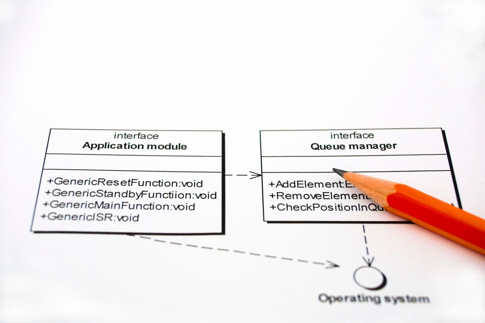

# 2.5 Diseño de Pipelines Escalables con SOLID

¿Por qué se rompen los procesos de ETL (Extracción, Transformación y Carga) cuando el negocio pide un cambio pequeño? Generalmente, porque el código está "muy acoplado": mover una pieza hace caer a las demás.

Los principios SOLID (postulados por Robert C. Martin) son 5 reglas de oro para diseñar software que resista el cambio. Vamos a ver cómo aplican específicamente en el mundo de los Datos.

## S - Single Responsibility Principle (SRP)

"*Un módulo debe tener una única razón para cambiar.*"

El Problema en BI: Usted tiene un "Script Dios" (`etl_ventas.py`) que se conecta a la base de datos, limpia nulos, calcula el IVA y envía un correo al gerente.

+ Si cambia la contraseña de la BD, edita el archivo.
+ Si el gerente pide cambiar el asunto del correo, edita el *mismo* archivo.
+ Riesgo: Al editar el correo, borra sin querer una línea de la conexión a la BD.

La Solución: Dividir en especialistas.

```
# 1. Responsabilidad: Extraer
class ExtractorVentas:
    def obtener_datos(self):
        return [100, 200, 300]

# 2. Responsabilidad: Lógica de Negocio
class CalculadoraImpuestos:
    def agregar_iva(self, montos):
        return [m * 1.19 for m in montos]

# 3. Responsabilidad: Comunicación
class Notificador:
    def enviar_alerta(self, mensaje):
        print(f"📧 Enviando: {mensaje}")

# Orquestador (Quien une las piezas)
def ejecutar_pipeline():
    datos = ExtractorVentas().obtener_datos()
    datos_con_iva = CalculadoraImpuestos().agregar_iva(datos)
    Notificador().enviar_alerta(f"Procesados {len(datos_con_iva)} registros.")
```

## O - Open/Closed Principle (OCP)

"*Abierto para extensión, cerrado para modificación.*"

El Problema en BI: Su jefe le pide exportar el reporte en CSV. A la semana siguiente, en JSON. A la siguiente, en Parquet.

Si usted tiene una función llena de `if formato == 'csv': ... elif formato == 'json': ...`, cada nuevo formato implica tocar código viejo que ya funcionaba, arriesgando bugs.

La Solución: Polimorfismo. Definimos un "contrato" y creamos nuevas clases para nuevos formatos sin tocar las anteriores.

```
from abc import ABC, abstractmethod

# El Contrato (Abstract Base Class)
class Exportador(ABC):
    @abstractmethod
    def guardar(self, datos):
        pass

# Extensión 1
class ExportadorCSV(Exportador):
    def guardar(self, datos):
        print("💾 Guardando en .csv")

# Extensión 2 (Nueva funcionalidad)
class ExportadorJSON(Exportador):
    def guardar(self, datos):
        print("💾 Guardando en .json")

# El Pipeline no sabe qué formato usa, solo sabe que puede "guardar"
def finalizar_proceso(exportador: Exportador, datos):
    exportador.guardar(datos) 

# Uso:
finalizar_proceso(ExportadorJSON(), [1, 2, 3])
```

## L - Liskov Substitution Principle (LSP)

"*Las subclases deben ser sustituibles por sus clases base sin romper el programa.*"

El Problema en BI: Imagine que tiene una clase padre FuenteDatos que devuelve un DataFrame. Usted crea una hija `FuenteAPI` que devuelve un **Diccionario JSON**. Si el pipeline espera un DataFrame y recibe un diccionario, el código explotará (`AttributeError: 'dict' has no attribute 'head'`).

La Regla: Si la clase padre promete devolver un pato, la clase hija no puede devolver un tigre.

La Solución: Estandarizar salidas.

```
import pandas as pd

class FuenteDatos(ABC):
    @abstractmethod
    def leer(self) -> pd.DataFrame: # El contrato promete un DataFrame
        pass

class FuenteSQL(FuenteDatos):
    def leer(self) -> pd.DataFrame:
        return pd.DataFrame({"ventas": [10, 20]})

# VIOLACIÓN DE LISKOV (Lo que NO se debe hacer)
class FuenteAPI_Mala(FuenteDatos):
    def leer(self):
        return {"ventas": [10, 20]} # ❌ Rompe el contrato, devuelve dict

# CUMPLIMIENTO DE LISKOV (Lo correcto)
class FuenteAPI_Buena(FuenteDatos):
    def leer(self) -> pd.DataFrame:
        json_data = {"ventas": [10, 20]}
        return pd.DataFrame(json_data) # ✅ Convierte a DataFrame antes de devolver
```

## I - Interface Segregation Principle (ISP)

"*Los clientes no deben depender de métodos que no usan.*"

El Problema en BI: Creamos una "Mega-Interfaz" llamada `ConectorDatos` que obliga a tener `leer_sql`, `escribir_sql`, `enviar_email`. Si creo una clase para leer un archivo local (`LectorCSV`), me veo obligado a implementar `enviar_email` (dejándolo vacío o lanzando error) aunque un CSV no envíe emails. Eso es código sucio.



La Solución: Interfaces pequeñas y específicas.

```
# Mal diseño: Interfaz gigante
# class ConectorTodoPoderoso(ABC):
#     def leer(self): pass
#     def escribir(self): pass
#     def auditar(self): pass

# Buen diseño: Interfaces segregadas
class Lector(ABC):
    @abstractmethod
    def leer(self): pass

class Escritor(ABC):
    @abstractmethod
    def escribir(self, datos): pass

# Ahora puedo tener una clase que SOLO lee (ej. archivo de configuración)
# sin estar obligada a saber cómo escribir.
class ConfigLoader(Lector):
    def leer(self):
        return "Configuración cargada"
```

## D - Dependency Inversion Principle (DIP)

"*Dependa de abstracciones, no de concreciones.*"

Este es el principio más importante para Testing.

El Problema en BI: Si dentro de su clase Reporte usted escribe `self.db = MySQLConnection()`, su reporte está "casado" con MySQL. Si quiere probar el reporte en su computador local (donde no tiene MySQL instalado), no puede. El código fallará.

La Solución: Inyección de Dependencias. El reporte no crea la conexión, la recibe.

```
# Abstracción
class BaseDatos(ABC):
    @abstractmethod
    def obtener_ventas(self): pass

# Concreción 1: La base real
class MySQLProduccion(BaseDatos):
    def obtener_ventas(self):
        return [100, 500, 200] # Conecta a la BD real

# Concreción 2: Base falsa para pruebas (Mock)
class BaseDatosFalsa(BaseDatos):
    def obtener_ventas(self):
        return [10, 10, 10] # Datos controlados para testear

# Clase de Alto Nivel
class GeneradorReporte:
    # 💉 INYECCIÓN DE DEPENDENCIA: Recibimos la BD, no la creamos adentro
    def __init__(self, db: BaseDatos):
        self.db = db

    def total_ventas(self):
        return sum(self.db.obtener_ventas())

# Escenario A: Producción
reporte_real = GeneradorReporte(MySQLProduccion())

# Escenario B: Testing (Sin conexión a internet ni BD)
reporte_test = GeneradorReporte(BaseDatosFalsa())
print(f"Test total: {reporte_test.total_ventas()}") # Funciona perfecto
```

## Resumen: SOLID en el día a día del Ingeniero de Datos

| 🔤 Letra | 🧠 Principio            | 🏢 Traducción al BI real                                                        | 🚀 ¿Cuándo aplicarlo?                                                  |
| -------- | ----------------------- | ------------------------------------------------------------------------------- | ---------------------------------------------------------------------- |
| **S**    | *Single Responsibility* | No mezcles extracción, transformación y envío en el mismo script. Divide capas. | Cuando un `.py` supera 200 líneas o tiene múltiples responsabilidades. |
| **O**    | *Open/Closed*           | Nuevas entradas = nuevas clases. No sigas metiendo `if fuente == ...`.          | Si vas agregando JSON, Excel, SQL, API, Parquet, etc.                  |
| **L**    | *Liskov Substitution*   | Todas las fuentes deberían devolver el **mismo tipo**, ej. DataFrame.           | Cuando integras SQL + API + archivos en un proceso único.              |
| **I**    | *Interface Segregation* | No obligues a un conector *Read-Only* a implementar métodos `write()`.          | Cuando creas librerías internas o SDKs del equipo.                     |
| **D**    | *Dependency Inversion*  | Pasa la conexión o cliente externo como parámetro, no lo construyas adentro.    | Para testear sin acceder a producción y reducir acoplamiento.          |
